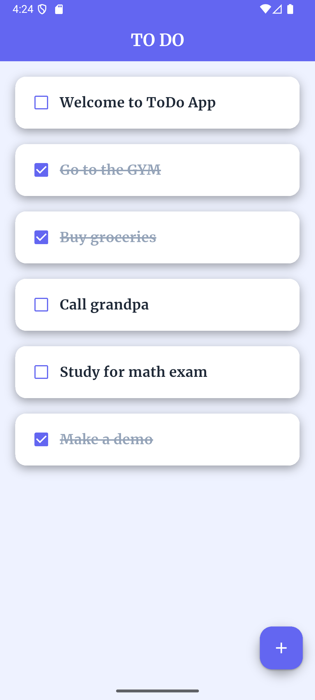
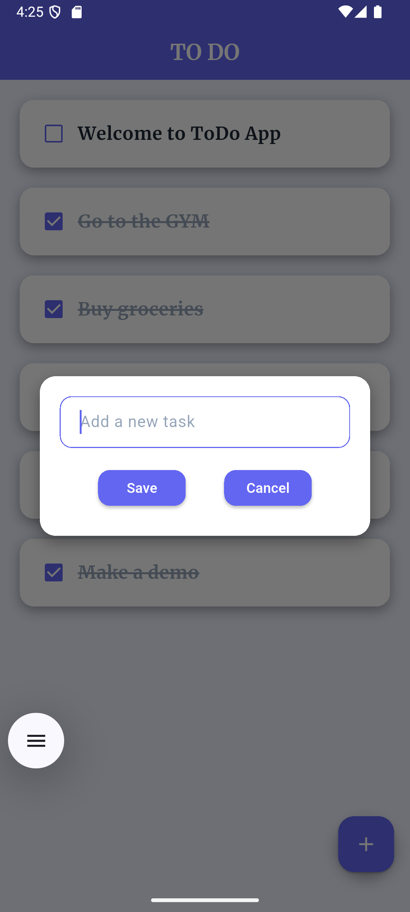
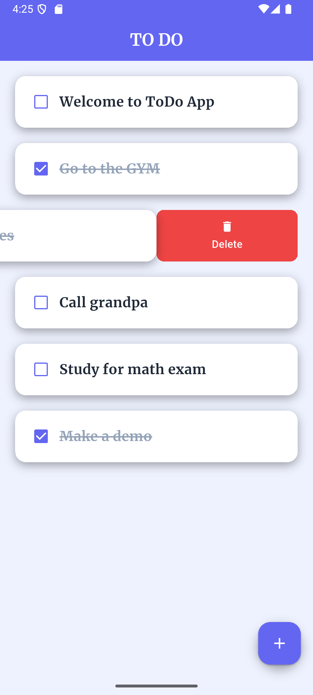
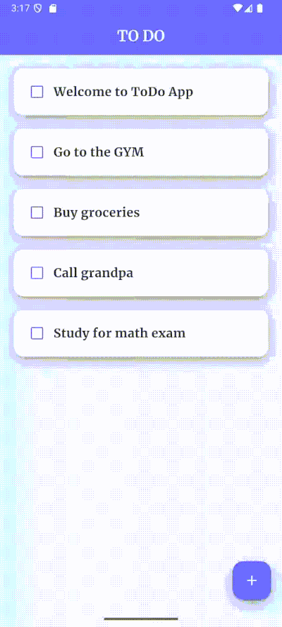

# ToDo App (Flutter)

A simple and clean **ToDo mobile application** built with **Flutter** that allows users to manage their daily tasks efficiently.

The application provides basic task management features such as creating, updating, and deleting tasks with a simple and intuitive user interface.

## Features

* Add new tasks
* Mark tasks as completed
* Delete tasks
* Simple and user-friendly interface
* Lightweight and fast performance

## Tech Stack

* **Framework:** Flutter
* **Language:** Dart
* **Platform:** Mobile (Android / iOS)

## Screenshots

<p align="center">
  
  
  
</p>
<p align = "center">
  
</p>

## Installation

1. Clone the repository

```bash
git clone https://github.com/muV3/flutter-todo-app.git
```

2. Navigate to the project directory

```bash
cd flutter-todo-app
```

3. Install dependencies

```bash
flutter pub get
```

4. Run the application

```bash
flutter run
```

## Future Improvements

* Task categories
* Task reminders and notifications
* Dark mode support
* Cloud synchronization

## Author

GitHub: https://github.com/muV3
